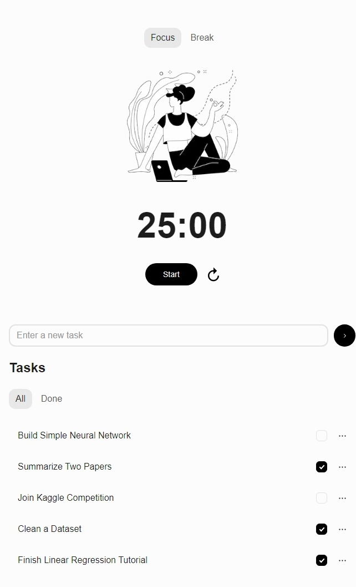

# To Do App with Pomidoro Timer

## Overview
This is a productivity application combining a to-do list with a Pomidoro timer.

## Features
- Add new tasks
- Edit tasks
- Delete tasks
- Check off completed tasks
- Focus/Break Timer (Pomidoro)
- Save tasks to local storage

## How to Run
1. Clone the repository
2. Install dependencies using `npm install`
3. Start the application using `npm run dev`

